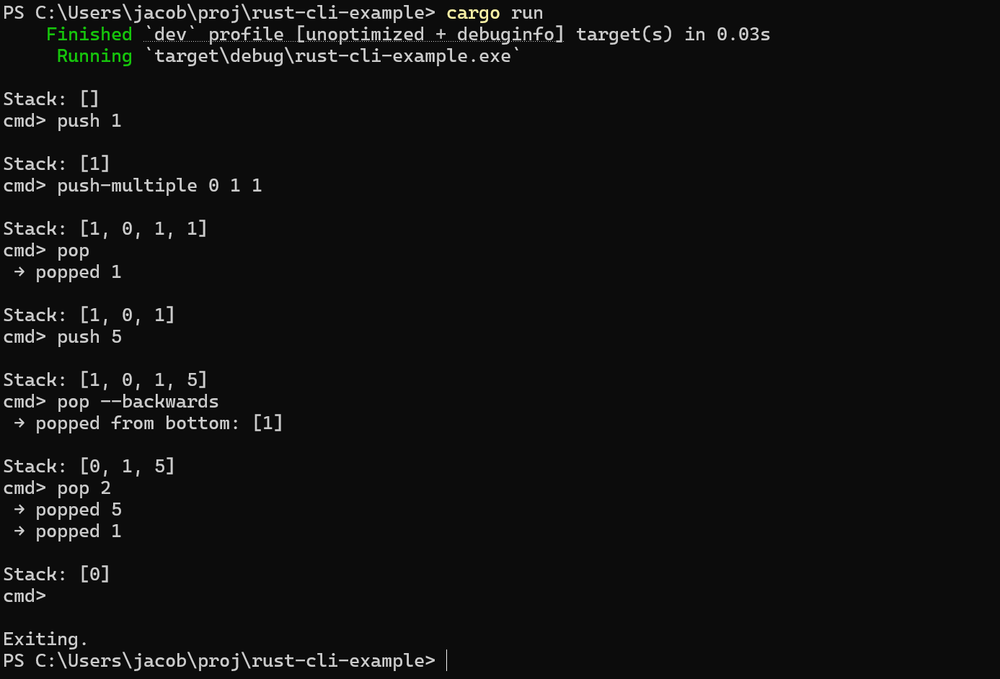

# Basic Integer Stack CLI 

A quick rust CLI for mainting a stack. Contains push and pop commands. To use, simply run a quick cargo run (or just the exe). To add numbers, type 

```
push [num]
```

To pop the top element off the stack, type 

```
pop
```

To exit, run a keyboard interrupt with ctrl + c.

### Example use

